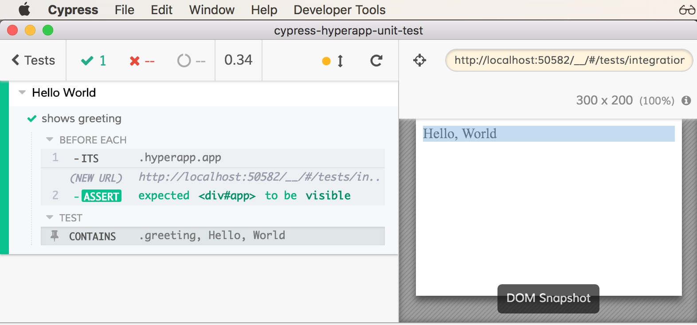

# cypress-hyperapp-unit-test

> Unit test [Hyperapp](https://hyperapp.js.org/) components using [Cypress](https://www.cypress.io/)

[![NPM][npm-icon] ][npm-url]

[![Build status][ci-image] ][ci-url]
[![semantic-release][semantic-image] ][semantic-url]
[![js-standard-style][standard-image]][standard-url]
[][cypress dashboard url]
[![renovate-app badge][renovate-badge]][renovate-app]

[renovate-badge]: https://img.shields.io/badge/renovate-app-blue.svg
[renovate-app]: https://renovateapp.com/

## TLDR

* What is this? This package allows you to use [Cypress](https://www.cypress.io/) test runner to unit test your Hyperapp components with zero effort. The component runs in the real browser with full power of Cypress E2E test runner: [live GUI, powerful API, screen recording, historical DOM snapshots, CI support, cross-platform](https://www.cypress.io/features/).

* The line between unit testing a component that renders into a DOM, makes HTTP requests, uses browser API and an end-to-end test for a complete web application is becoming very blurry in my opinion. Hope this little bridge between Hyperapp and Cypress test runner proves it. See examples below - some of them are testing individual components, some full apps. But the unit and end-to-end tests look and run _very much alike_.

## Install

Requires [Node](https://nodejs.org/en/) version 6 or above.

```sh
npm install --save-dev cypress-hyperapp-unit-test
```

also requires peer dependencies in your project

```sh
npm install cypress hyperapp
```

## API

You can import this module from your own tests

```js
import { mount } from 'cypress-hyperapp-unit-test'
// import or code state, action and view
beforeEach(() => {
  mount(state, actions, view)
})
// you get fresh mini-app running in each test
```

## Use

In your Cypress spec files (the example below is from file [cypress/integration/hello-world-spec.js](cypress/integration/hello-world-spec.js)) mount the application, just like you would "normally".

```js
import { mount } from 'cypress-hyperapp-unit-test'
import { h } from 'hyperapp'
// view function we are testing
const view = (state, actions) => h('div', { class: 'greeting' }, 'Hello, World')
describe('Hello World', () => {
  beforeEach(() => {
    const state = {}
    const actions = {}
    // no state or actions for this simple example
    mount(state, actions, view)
  })
  it('shows greeting', () => {
    // use any Cypress command - we have
    // real Hyperapp application for testing
    cy.contains('.greeting', 'Hello, World')
  })
})
```

Start Cypress using `$(npm bin)/cypress open` and execute the spec. You have full end-to-end test run but with your component! Why waste time on unit testing inside synthetic DOM's blackbox if you could _see_ the result, _inspect_ the DOM, _investigate_ how it works using time-travelling debugger?



## Examples

* [simple view function without any actions](cypress/integration/hello-world-spec.js)
* [components without and with actions](cypress/integration/hello-world-component-spec.js)
* [single TodoItem component](cypress/integration/todo-item-spec.js)
* [entire TodoList component](cypress/integration/todo-list-spec.js)
* [server XHR stubbing](cypress/integration/server-todos-spec.js)
* [TodoMVC application E2E test](cypress/integration/todo-app-e2e.js) for [apps/todo.html](apps/todo.html)

Unit tests and E2E tests start looking very much alike. Compare [TodoList unit test](cypress/integration/todo-list-spec.js) and [TodoMVC end-to-end test](cypress/integration/todo-app-e2e.js).

* Components and tests for Hyperapp using JSX are their own repository [bahmutov/hyperapp-counter-jsx-example](https://github.com/bahmutov/hyperapp-counter-jsx-example) to keep this repo simple.

## Repo organization

* [src/index.js](src/index.js) the main file implementing `mount`
* [components](components) different Hyper components for testing
* [actions](actions) pure actions functions used from components and tests
* [apps](apps) one or more complete bundled applications (build them using `npm run build`)
* [cypress/integration](cypress/integration) example spec files showing various test situations

See video of tests running on CI on the project's [Cypress Dashboard][cypress dashboard url]

## API Extras

* Mounted component's actions object is attached to the global `Cypress.main` variable. The name `main` was picked because that's what Hyperapp uses in its docs `const main = app(state, ...)`
* The `mount` function adds an action `_getState` to the `actions` object, if there is not one already present. This allows you to get the current state of the component for inspection.

```js
Cypress.main.setName('Joe')
Cypress.main
  ._getState()
  .its('name')
  .should('equal', 'Joe')
Cypress.main.setAge(37)
Cypress.main._getState().should('deep.equal', {
  name: 'Joe',
  age: 37
})
```

Note: the `Cypress.main` wraps returned Hyperapp actions with `cy.then` to queue the calls through the Cypress command queue. Thus the above code looks synchronous, but in reality there could be DOM updates, network calls, etc, and it still works.

## Package scripts

* `npm run build` bundles complete applications if you want to run tests against full applications
* `npm run cy:open` starts Cypress GUI, which is great for TDD mode
* `npm run cy:run` runs Cypress headlessly, testing all specs. Same command [runs on CI](.travis.yml) with additional `--record` argument to record the run and send to the [Cypress Dashboard][cypress dashboard url]

## Similar adaptors

* [cypress-vue-unit-test](https://github.com/bahmutov/cypress-vue-unit-test)
* [cypress-react-unit-test](https://github.com/bahmutov/cypress-react-unit-test)
* [cypress-cycle-unit-test](https://github.com/bahmutov/cypress-cycle-unit-test)
* [cypress-svelte-unit-test](https://github.com/bahmutov/cypress-svelte-unit-test)
* [cypress-angular-unit-test](https://github.com/bahmutov/cypress-angular-unit-test)
* [cypress-hyperapp-unit-test](https://github.com/bahmutov/cypress-hyperapp-unit-test)
* [cypress-angularjs-unit-test](https://github.com/bahmutov/cypress-angularjs-unit-test)

### Small print

Author: Gleb Bahmutov &lt;gleb.bahmutov@gmail.com&gt; &copy; 2017

* [@bahmutov](https://twitter.com/bahmutov)
* [glebbahmutov.com](https://glebbahmutov.com)
* [blog](https://glebbahmutov.com/blog)

License: MIT - do anything with the code, but don't blame me if it does not work.

Support: if you find any problems with this module, email / tweet /
[open issue](https://github.com/bahmutov/cypress-hyperapp-unit-test/issues) on Github

## MIT License

Copyright (c) 2017 Gleb Bahmutov &lt;gleb.bahmutov@gmail.com&gt;

Permission is hereby granted, free of charge, to any person
obtaining a copy of this software and associated documentation
files (the "Software"), to deal in the Software without
restriction, including without limitation the rights to use,
copy, modify, merge, publish, distribute, sublicense, and/or sell
copies of the Software, and to permit persons to whom the
Software is furnished to do so, subject to the following
conditions:

The above copyright notice and this permission notice shall be
included in all copies or substantial portions of the Software.

THE SOFTWARE IS PROVIDED "AS IS", WITHOUT WARRANTY OF ANY KIND,
EXPRESS OR IMPLIED, INCLUDING BUT NOT LIMITED TO THE WARRANTIES
OF MERCHANTABILITY, FITNESS FOR A PARTICULAR PURPOSE AND
NONINFRINGEMENT. IN NO EVENT SHALL THE AUTHORS OR COPYRIGHT
HOLDERS BE LIABLE FOR ANY CLAIM, DAMAGES OR OTHER LIABILITY,
WHETHER IN AN ACTION OF CONTRACT, TORT OR OTHERWISE, ARISING
FROM, OUT OF OR IN CONNECTION WITH THE SOFTWARE OR THE USE OR
OTHER DEALINGS IN THE SOFTWARE.

[npm-icon]: https://nodei.co/npm/cypress-hyperapp-unit-test.svg?downloads=true
[npm-url]: https://npmjs.org/package/cypress-hyperapp-unit-test
[ci-image]: https://travis-ci.org/bahmutov/cypress-hyperapp-unit-test.svg?branch=master
[ci-url]: https://travis-ci.org/bahmutov/cypress-hyperapp-unit-test
[semantic-image]: https://img.shields.io/badge/%20%20%F0%9F%93%A6%F0%9F%9A%80-semantic--release-e10079.svg
[semantic-url]: https://github.com/semantic-release/semantic-release
[standard-image]: https://img.shields.io/badge/code%20style-standard-brightgreen.svg
[standard-url]: http://standardjs.com/
[cypress dashboard url]: https://dashboard.cypress.io/#/projects/zsoa27
